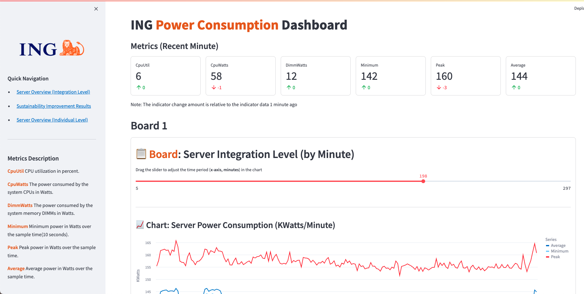
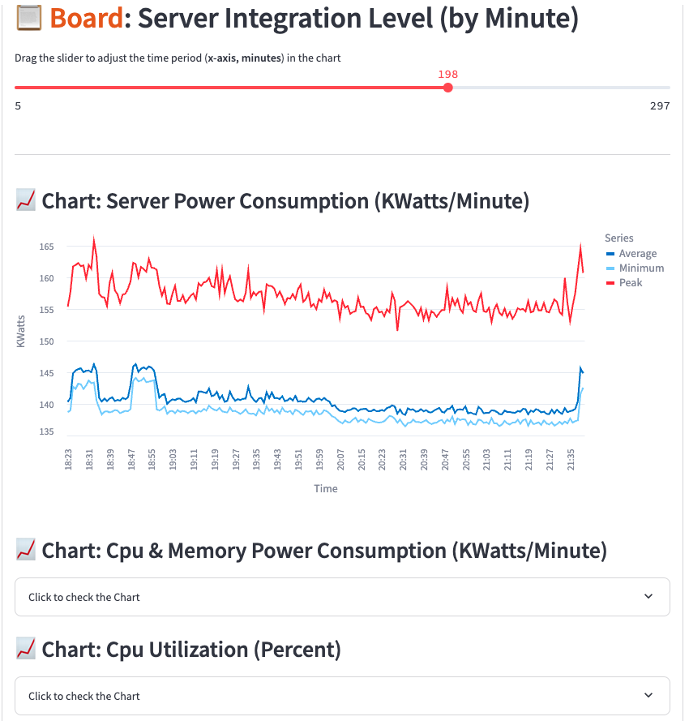
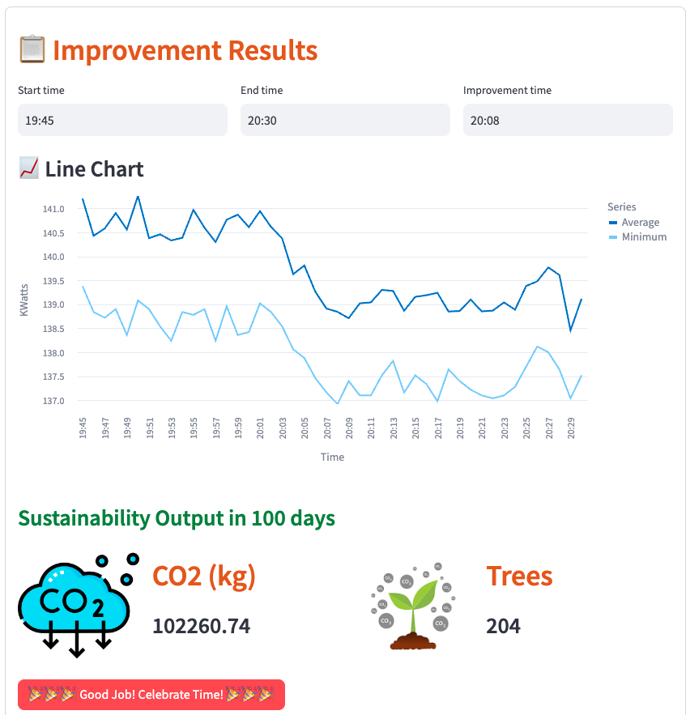
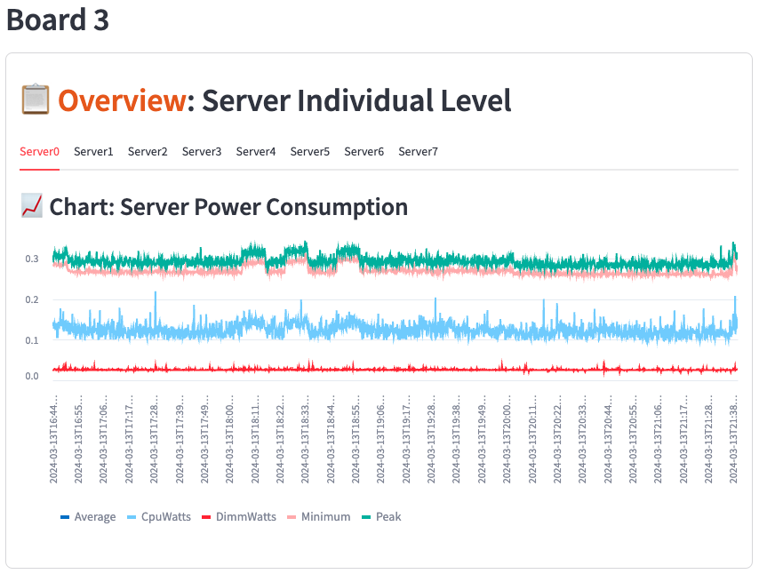

# GreenHeros - Server Power Consumption Project

## How to run 
- Clone to local
- Install dependencies ```pip install -r requirements.txt```
- Create a data directory, and add server data CSV into it
- Run the app : ```streamlit run streamlit_app.py```

## File structure
There are two main code files
- **power_data_handler.py**: data processing module with Pandas
- **streamlit_app.py**: the dashboard itself

## Dashboard Data
There are server power data from 8 servers.
each server has 6 metrics:
- **CpuUtil** CPU utilization in percent.
- **CpuWatts** The power consumed by the system CPUs in Watts.
- **DimmWatts** The power consumed by the system memory DIMMs in Watts.
- **Minumum** Minimum power in Watts over the sample time(10 seconds).
- **Peak** Peak power in Watts over the sample time.
- **Average** Average power in Watts over the sample time.

## Dashboard sturcture
The Dashboard includes 3 main boards.


- Server Integration Level Power consumption and CPU utilization overview

- Improvement Results Board

- Server Individual Level Board

